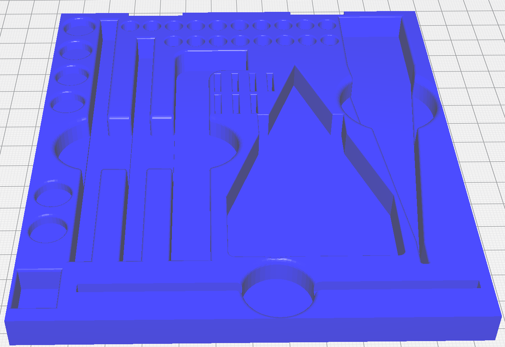
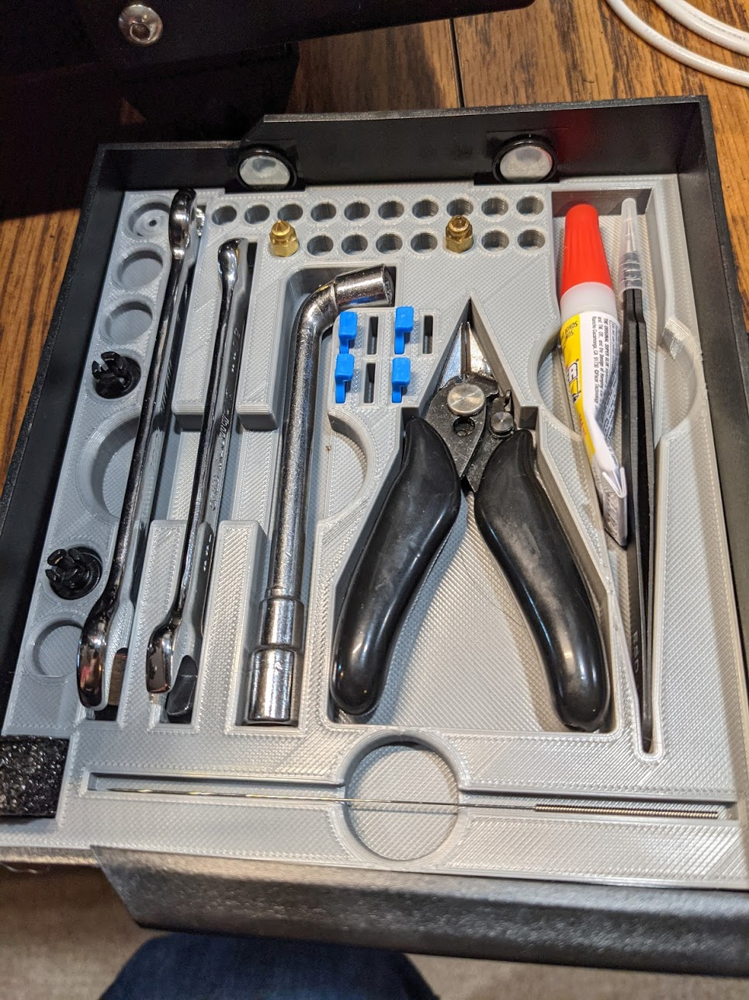

# CR6 SE Drawer Tray

This is a toolholder for my Creality CR6 SE 3D Printer

# Changelog
2021/01/07 - Initial upload: "v2" from Fusion 360.  Hasn't been printed for test fit yet.

## Tools

Default tools that come with the printer:

- Filament snippers
- 8mm/10mm open end wrench
- Nozzle clearing pin
- Nozzle and clip storage

Additional Tools

- [uxcell Metric Double Open End Wrench 5.5mm x 7mm](https://smile.amazon.com/gp/product/B07D4B8GWW)
- Pair of tweezers

## Design

Autocad Fusion 360 

## Slicer

Ultimaker Cura 4.8.0

- Printer: Creality CR6 SE

- Layer Height: 0.2mm
- Infill Density: 10%
- Infill Pattern: Grid

- Filament: Inland PLA+ 1.75mm Silver
- Material: PLA+
- Print Temperature: 215 degrees C

## Preview

